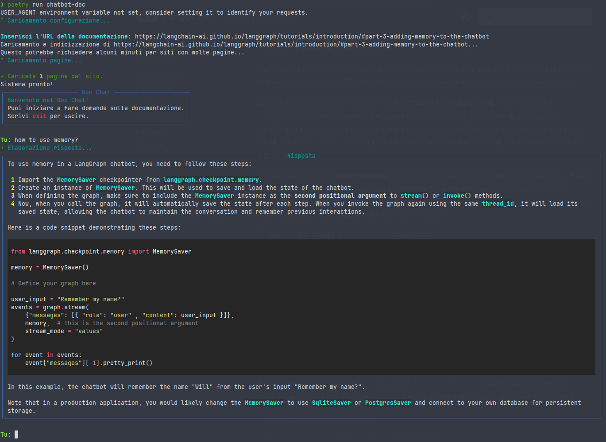

# ChatBot-DOC

<div align="center">
  
</div>

A simple yet powerful chatbot that allows you to have conversations with any web-based documentation using LangChain and Groq's LLM API.

## Features

- Chat with any web-based documentation
- Uses Groq's Llama-3.3-70b-versatile model for high-quality responses
- Local embeddings using Sentence Transformers
- Rich text interface
- Automatic environment setup and configuration
- Context-aware responses with document chunking
- Configurable parameters for fine-tuning

## Prerequisites

- Python 3.13+
- Poetry
- Groq API key
- OpenAI API key (optional)
- LangChain API key

## Installation

1. Clone the repository:
```bash
git clone https://github.com/paolaguarasci/chatbot-doc.git
cd chatbot-doc
```

2. Install dependencies with Poetry:
```bash
poetry install
```

## Configuration

Create a `.env` file in the root directory with the following configuration:

```
# Groq Configuration
GROQ_API_KEY=your_groq_api_key_here
GROQ_API_MODEL=llama-3.3-70b-versatile

# OpenAI Configuration (optional)
OPENAI_API_KEY=your_openai_api_key_here
OPENAI_API_MODEL=gpt-4

# LangChain Configuration
LANGCHAIN_API_KEY=your_langchain_api_key_here
LANGCHAIN_TRACING_V2=true
LANGCHAIN_DEBUG_MODE=true

# Web Scraping Configuration
USER_AGENT="Mozilla/5.0 (Windows NT 10.0; Win64; x64) AppleWebKit/537.36 (KHTML, like Gecko) Chrome/129.0.0.0 Safari/537.3"
```

## Usage

Run the chatbot:
```bash
poetry run chatbot-doc
```

1. Enter the URL of the documentation you want to chat with
2. Start asking questions about the documentation
3. Type 'exit' to quit

## Dependencies

- langchain
- langchain-core
- langchain-groq
- langchain-community
- langchain-openai
- langgraph
- chromadb
- python-dotenv
- beautifulsoup4
- rich

## License

MIT

## Contributing

Contributions are welcome! Please feel free to submit a Pull Request.